# Description

At Engenious, I worked as the Lead Frontend Engineer for a white-label fitness product. I architected the frontend in collaboration with a backend engineer to integrate a custom backend and payment system.
The web version serves as a user onboarding, profile management and data collection funnel, with a key objective of avoiding high payment processing fees from the Google and Apple app stores. The project was built using React, TypeScript and Scss as the core tech stack.

# Features

- Multi-step user onboarding form with persistent storage and Google Analytics integration
- BMI calculator for personalized health insights
- Authentication via OAuth and email
- Subscription splash screen for user engagement
- Stripe integration for secure payments
- Manage subscriptions with instant data revalidation
- Payment card management
- User profile management

# Demo Video

▶️ **[Watch the demo video](https://vimeo.com/1055877205/7e9e113a9d)**

# Screenshots

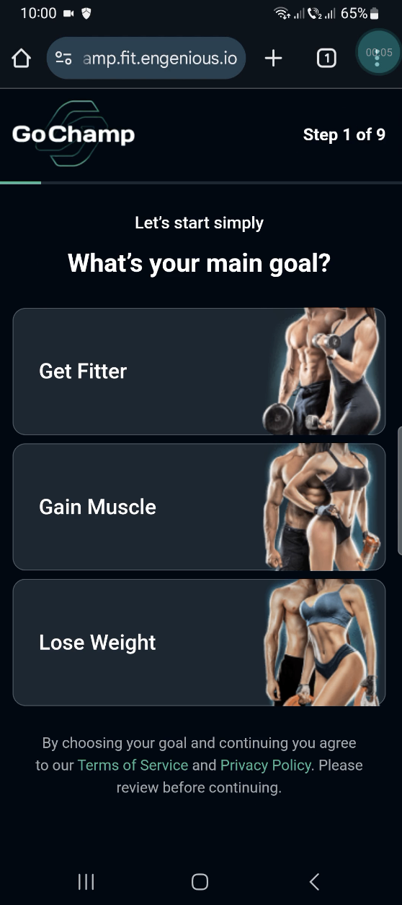
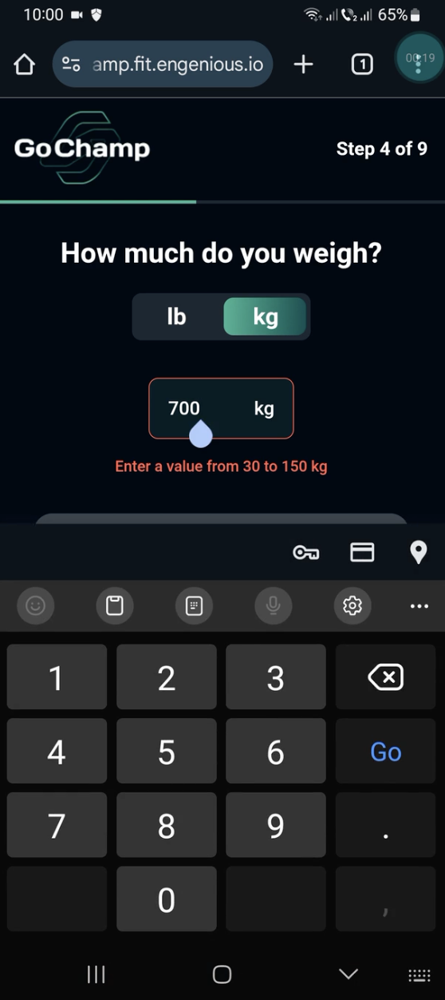
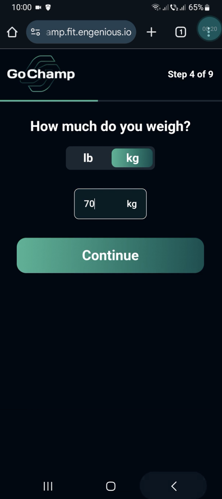
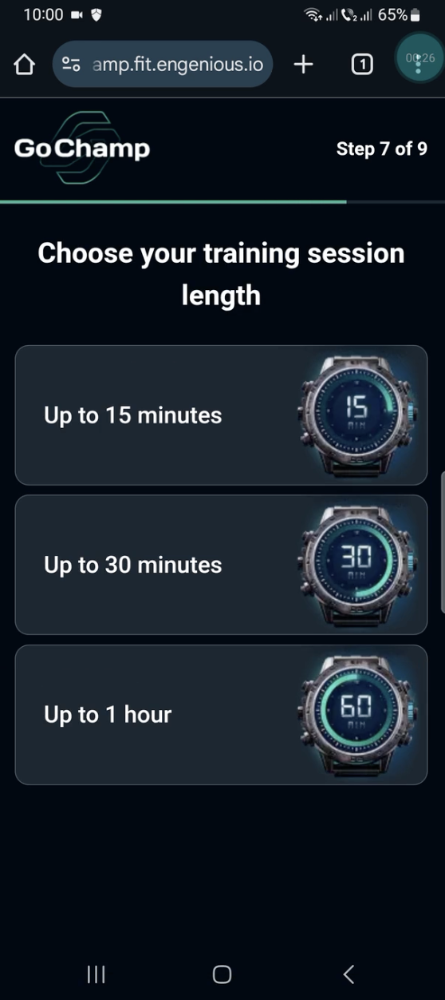
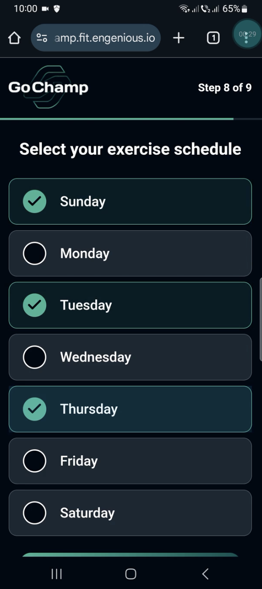
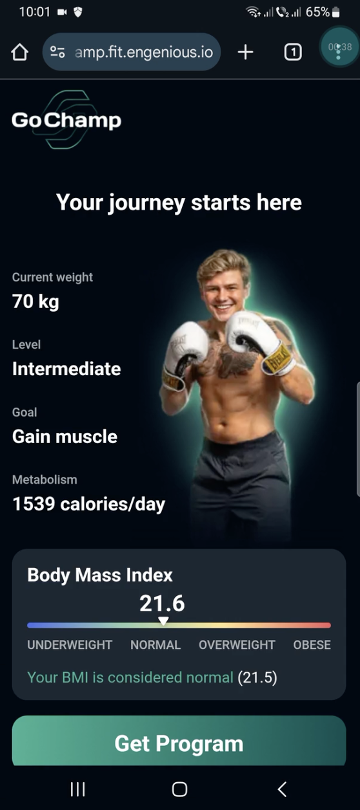
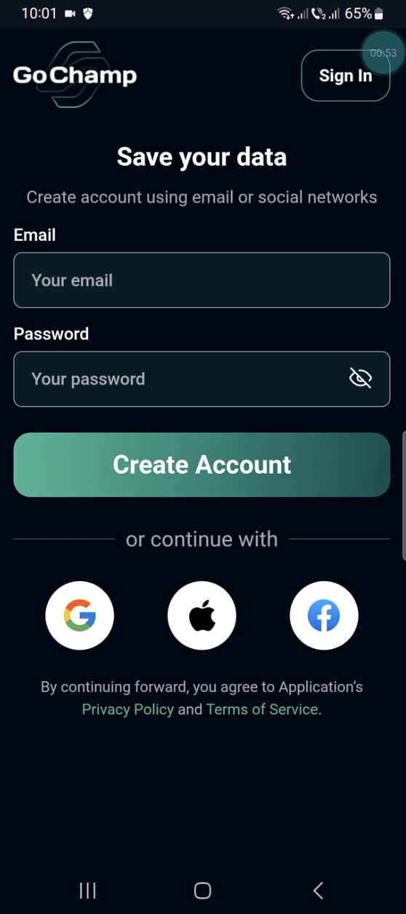
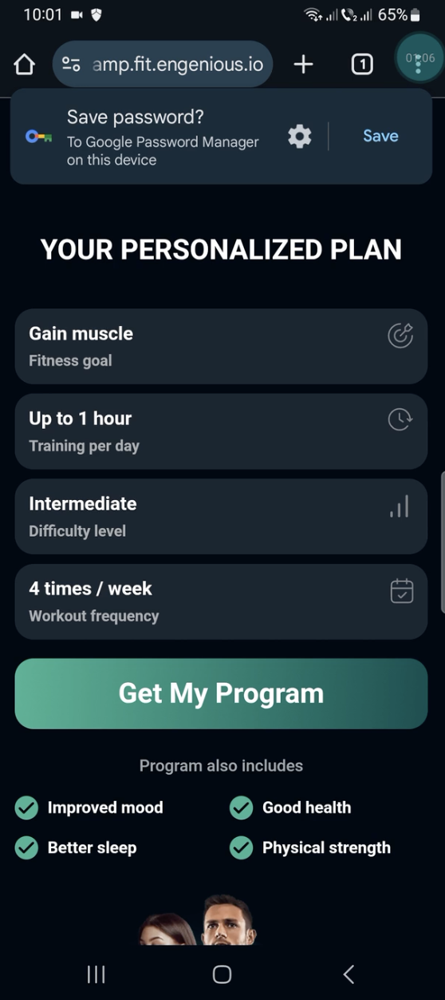
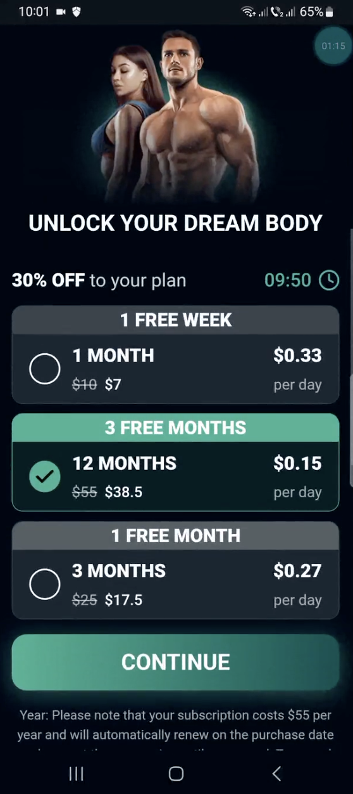
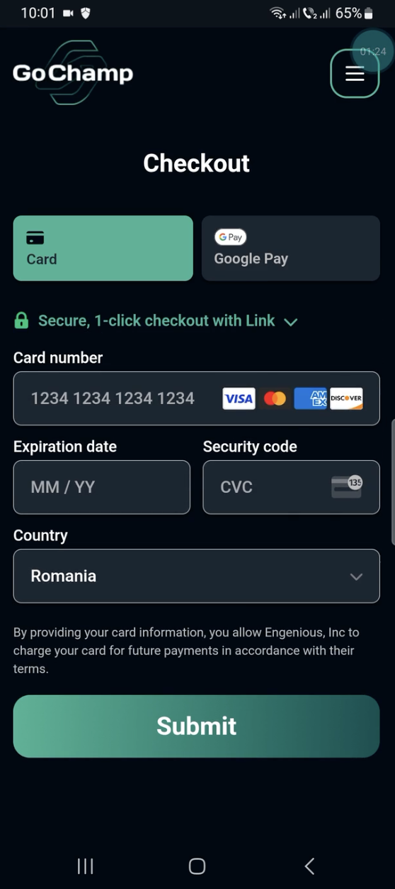
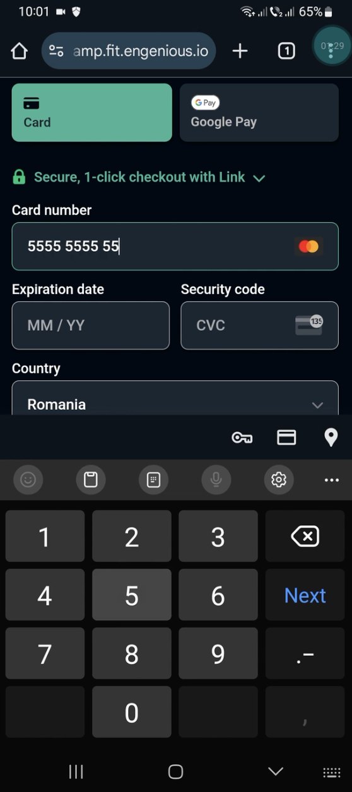

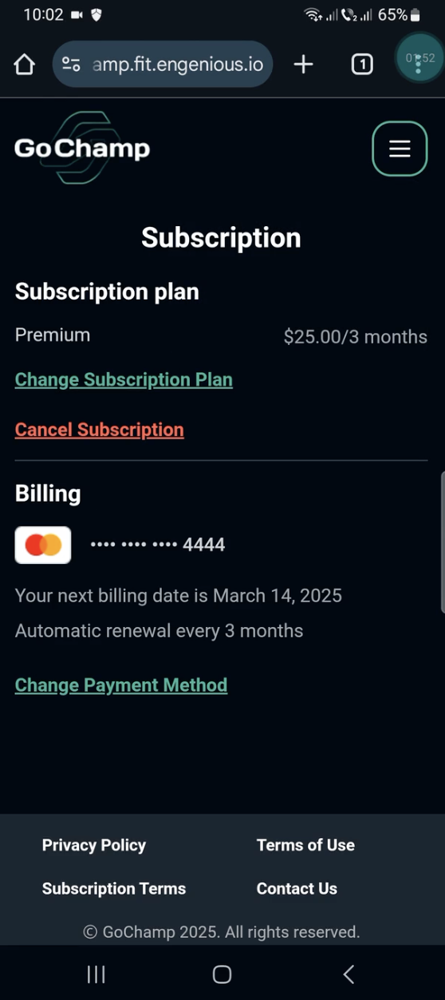
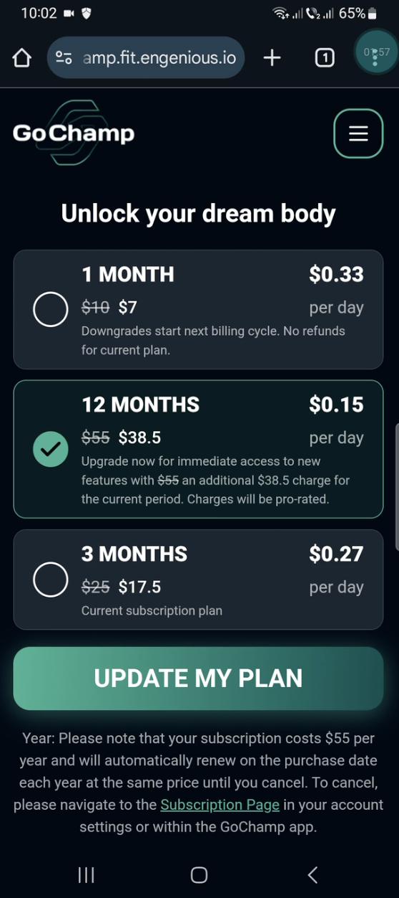
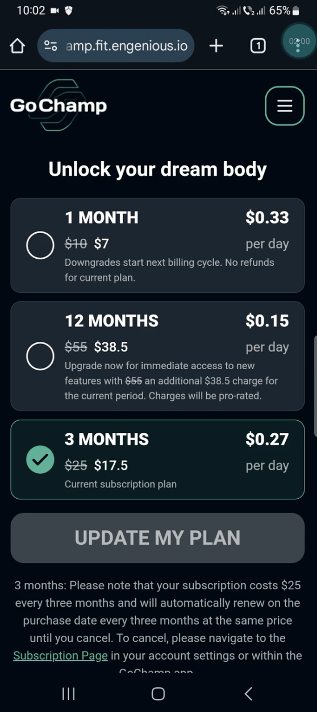
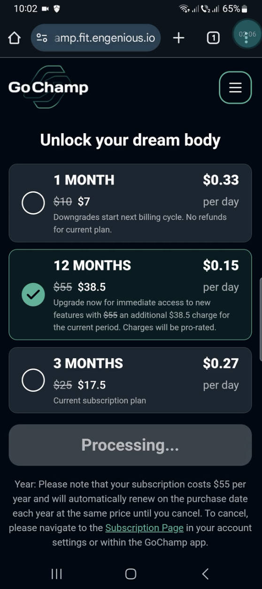
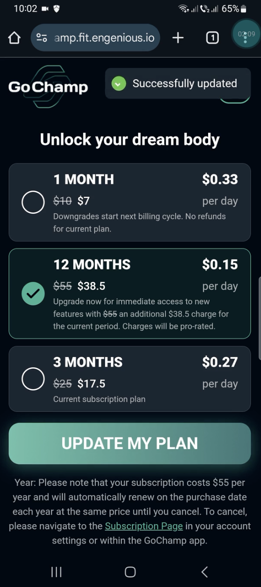
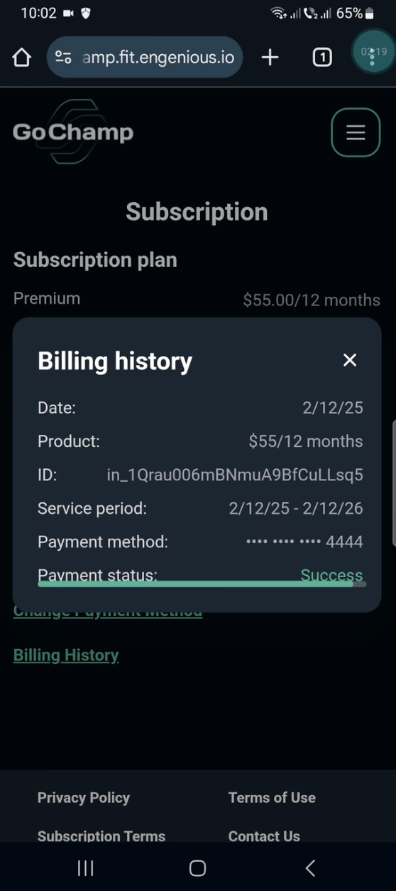
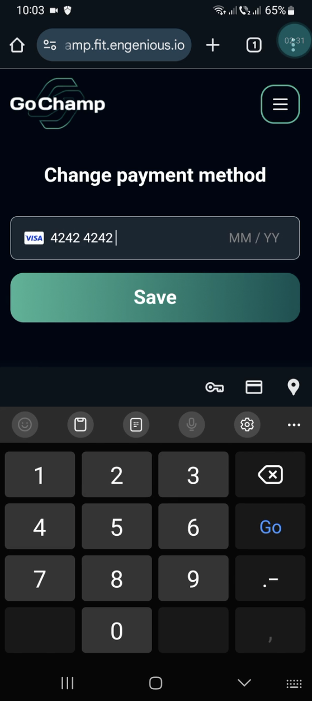
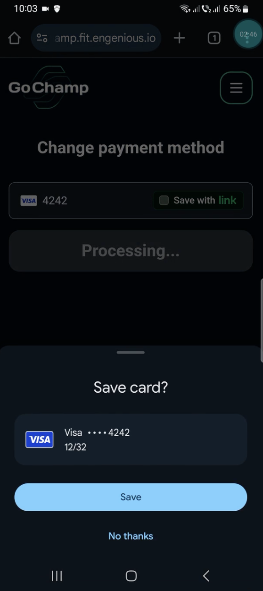
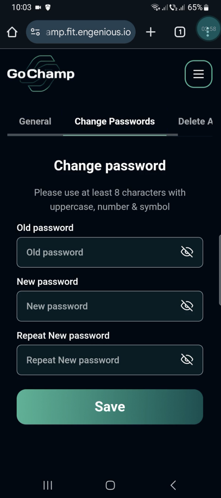
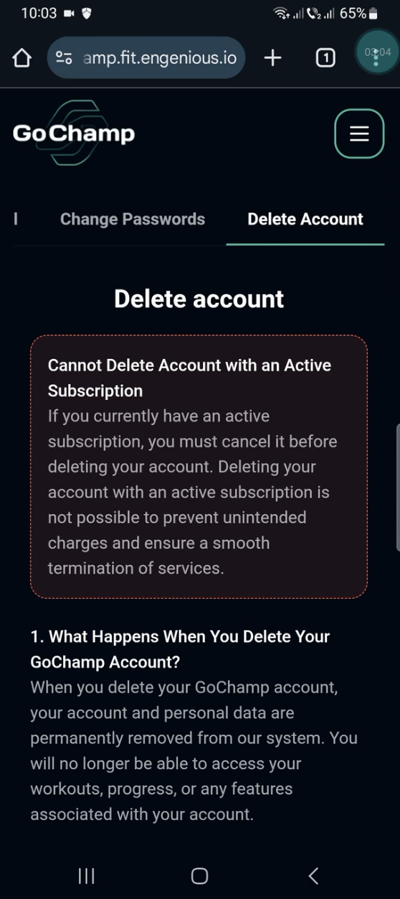
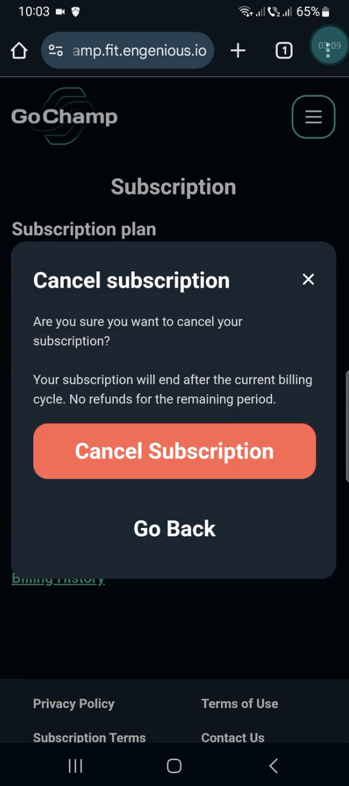
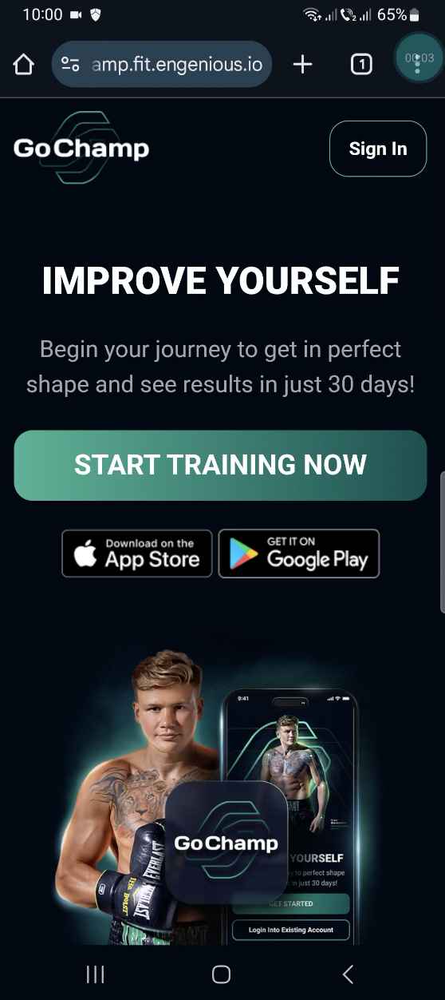
